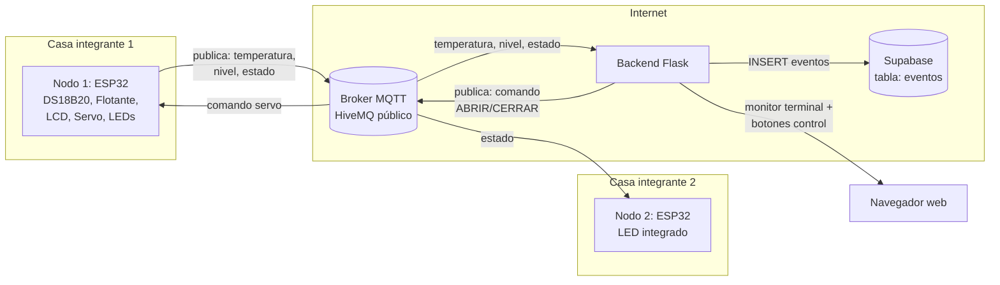
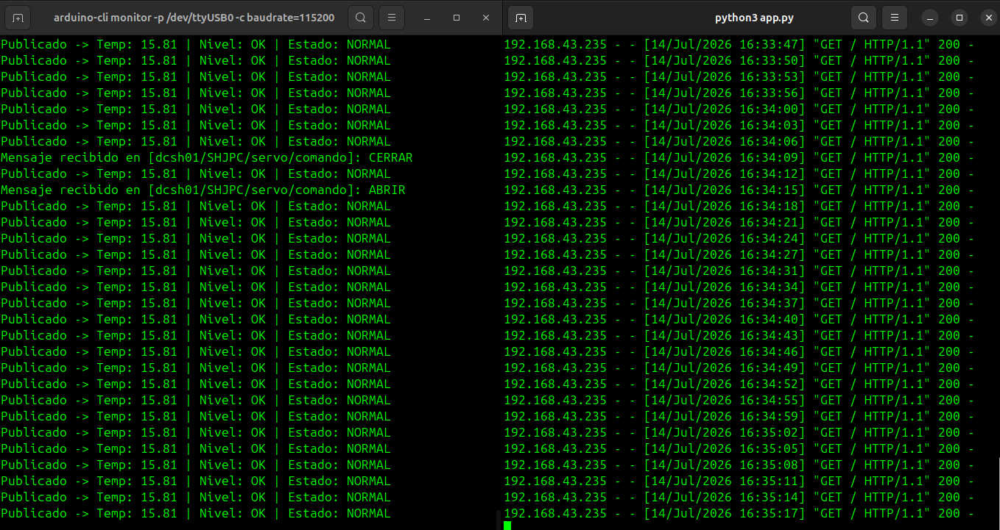
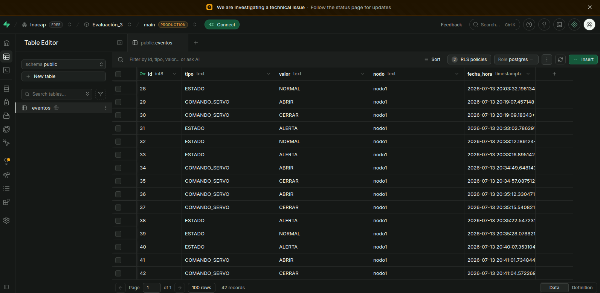
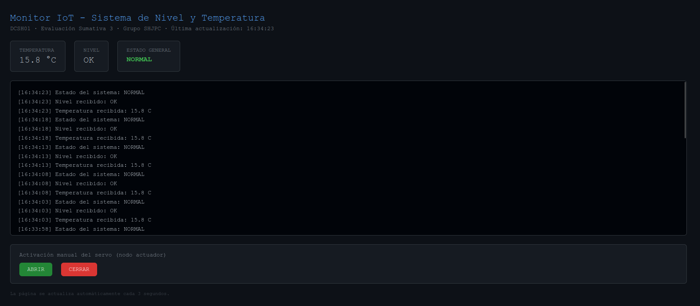
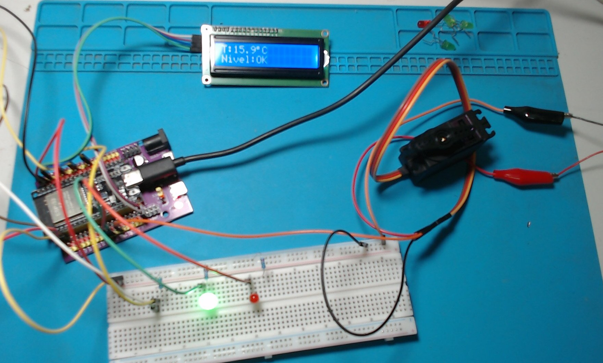

# Sistema IoT de Monitoreo de Nivel y Temperatura con Actuación Remota

**DCSH01 - Desarrollo de Software para Hardware — Evaluación Sumativa 3**
Grupo: **SHJPC**

## 1. Descripción del sistema

Este proyecto implementa un sistema IoT distribuido entre dos ubicaciones físicas distintas (cada integrante en su propia casa), comunicado mediante el protocolo **MQTT** a través del broker público de HiveMQ.

El **Nodo 1** monitorea la temperatura y el nivel de un líquido, actúa físicamente mediante un servomotor, y muestra su estado local en una pantalla LCD. Todos los eventos relevantes se publican por MQTT y quedan registrados con fecha y hora en una base de datos en la nube (**Supabase**). El **Nodo 2**, ubicado en otra casa, recibe esos eventos de forma remota y refleja visualmente las alertas mediante su LED integrado, demostrando que el sistema funciona de forma realmente distribuida (no solo entre dos placas sobre la misma mesa).

Un backend en **Flask** actúa como puente entre el broker MQTT y Supabase: se suscribe a los datos del Nodo 1, los muestra en un monitor estilo terminal en tiempo real, registra los eventos en la nube, y permite activar manualmente el servomotor del Nodo 1 desde el navegador.

## 2. Arquitectura del sistema



## 3. Justificación del rol de cada tarjeta

| Nodo | Rol | Justificación |
|---|---|---|
| **Nodo 1** (integrante 1) | Sensor + Actuador | Concentra la adquisición de datos (temperatura y nivel) y la actuación física real (servomotor). Es el "corazón" del sistema, donde ocurren los eventos que se registran en la nube. |
| **Nodo 2** (integrante 2) | Nodo remoto de notificación | Ubicado en una casa distinta, demuestra que el sistema funciona de forma distribuida a través de Internet (no en una red local compartida). Recibe el estado general por MQTT y lo refleja en su LED integrado, actuando como una alerta visual remota. |

## 4. Componentes utilizados

- ESP32 DevKit (x2)
- Sensor de temperatura digital DS18B20
- Sensor de nivel de líquido flotante
- Servomotor Tower Pro MG996R
- Pantalla LCD 16x2 con módulo I2C
- LEDs (verde y rojo) + resistencias de 220Ω
- Resistencia pull-up de 4.7kΩ (para el DS18B20)
- Fuente externa de 5V (cargador USB) para el servomotor

## 5. Protocolo de comunicación

Se utiliza **MQTT** sobre el broker público `broker.hivemq.com`, necesario porque ambos ESP32 operan en redes domésticas distintas (no es posible usar ESP-NOW ni HTTP en modo Access Point en este escenario).

Prefijo de topics del grupo: `dcsh01/SHJPC/`

| Topic | Publicado por | Contenido |
|---|---|---|
| `dcsh01/SHJPC/nodo1/temperatura` | Nodo 1 | Temperatura en °C |
| `dcsh01/SHJPC/nodo1/nivel` | Nodo 1 | `OK` / `CRITICO` |
| `dcsh01/SHJPC/nodo1/estado` | Nodo 1 | `NORMAL` / `ALERTA` |
| `dcsh01/SHJPC/servo/comando` | Flask | `ABRIR` / `CERRAR` |

## 6. Estructura del repositorio

```
.
├── README.md
├── .gitignore
├── esp32/
│   ├── nodo_sensor_actuador/
│   │   └── nodo_sensor_actuador.ino     # Nodo 1
│   └── nodo_remoto/
│       └── nodo_remoto.ino              # Nodo 2
├── flask/
│   ├── app.py
│   ├── requirements.txt
│   ├── .env.example
│   └── templates/
│       └── monitor.html
└── capturas/
    └── (capturas de pantalla y foto del circuito)
```

## 7. Instrucciones para ejecutar el proyecto

### 7.1 Nodo 1 (ESP32 sensor/actuador)

1. Abrir `esp32/nodo_sensor_actuador/nodo_sensor_actuador.ino` en Arduino IDE o compilar con `arduino-cli`
2. Editar `ssid` y `password` con los datos de la red WiFi (2.4GHz)
3. Instalar librerías: `OneWire`, `DallasTemperature`, `LiquidCrystal I2C`, `ESP32Servo`, `PubSubClient`
4. Compilar y subir a la placa

### 7.2 Nodo 2 (ESP32 remoto)

1. Abrir `esp32/nodo_remoto/nodo_remoto.ino`
2. Editar `ssid` y `password` con la red WiFi del segundo integrante
3. Instalar librería `PubSubClient`
4. Compilar y subir a la placa

### 7.3 Backend Flask

```bash
cd flask
python3 -m venv venv
source venv/bin/activate
pip install -r requirements.txt
cp .env.example .env
# Editar .env con la URL y API key reales del proyecto Supabase
python3 app.py
```

Luego abrir `http://localhost:5000` en el navegador.

### 7.4 Supabase

1. Crear un proyecto en [supabase.com](https://supabase.com)
2. En **SQL Editor**, ejecutar el script de creación de la tabla `eventos` con sus políticas RLS (incluido en la documentación del proyecto)
3. Copiar **Project URL** y **anon public key** desde **Project Settings → API** hacia el archivo `.env`

## 8. Capturas del funcionamiento

**Conexión WiFi y Monitor Serie de Arduino**



**Registro de eventos en Supabase**



**Monitor de datos en Flask**



**Circuito**



## 9. Integrantes

- [Sebastian Hueche]
- [Juan Pablo Carrillo]
